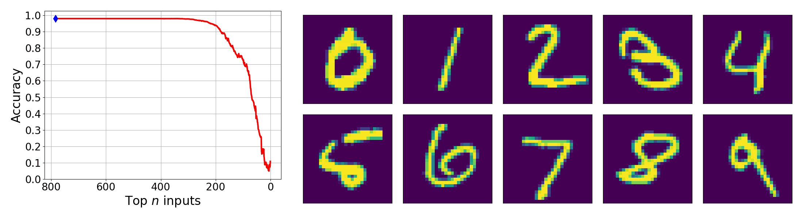

# Projected neural additive models as universal approximators

<p align='center'></p>

## Installation

### [Pip](https://packaging.python.org/en/latest/guides/installing-using-pip-and-virtual-environments/)

Create custom environment:

```bash
python3 -m venv pnam
```

Activate environment:

```bash
source pnam/bin/activate
```

Upgrade pip:

```bash
python3 -m pip install --upgrade pip
python3 -m pip --version
```

Install [PyTorch](https://pytorch.org/) with CUDA (Linux):

```bash
python3 -m pip install torch torchvision torchaudio --index-url https://download.pytorch.org/whl/cu***
```

Replace `***` with a supported CUDA version.

Install requirements:

```bash
python3 -m pip install -r requirements.txt
```

Install [Juliaup](https://github.com/JuliaLang/juliaup) (for [PySR](https://github.com/MilesCranmer/PySR)):

```bash
curl -fsSL https://install.julialang.org | sh
```

## Numerical experiments

To reproduce the results in Section 3.1, see

`knot_theory_classif.py`

and

`knot_theory_regress.py` or `knot_theory_regress.ipynb`.

To reproduce the results in Table A.3, see

`knot_theory_total_acc.ipynb`.

To reproduce the results in Section A.4, see

`mnist.py`.

To reproduce the results in Section A.5, see

`phase_field.py` or `phase_field.ipynb`.

## Citation

If you find this code useful, please consider citing our paper.

```bibtex
@inproceedings{phan2026projected,
    title={Projected neural additive models as universal approximators},
    author={Phan, Nhon N and Du, Qiang and Clayton, John D and Sun, WaiChing},
    booktitle={Advances in Neural Information Processing Systems},
    year={2026}
}
```
